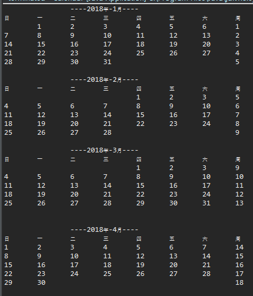

# Permanent Calendar

## Specification

It's a permanent calendar coding  with java && depends on java console.

### public static int week(int year, int month, int day)

Get the weekday of the date inputed.

### public static int monthDays(int year, int month)

Get the number of month day.

### public static String toMonthString(int year, int month)

Get the formatted string of a certain month of a certain year.

### public static String toYearString(int year)

Get the formated string(calendar string) of a certain year. 